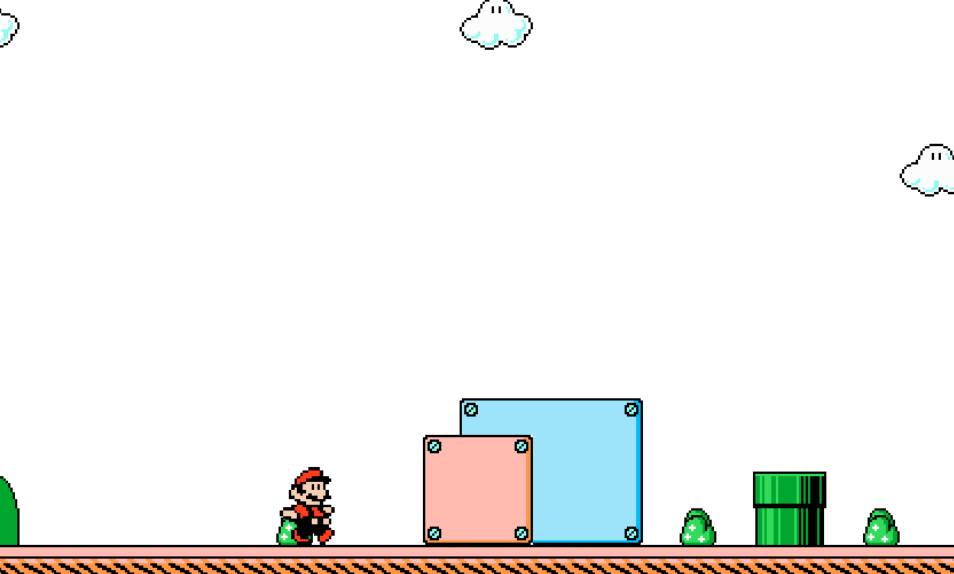

TinyPlumber
===========

**TinyPlumber** is a tiny platformer game using PixiJS.

## Screenshots

This project is under development. Any screenshot displayed here has been taken during tests.

## License

This project is distributed under the WTFPL v2.0

## Credits

- **mario.png** : https://www.spriters-resource.com/nes/supermariobros3/sheet/4230/
- **tileset.png** : http://www.mariomayhem.com/downloads/sprites/super_mario_bros_3_sprites.php
