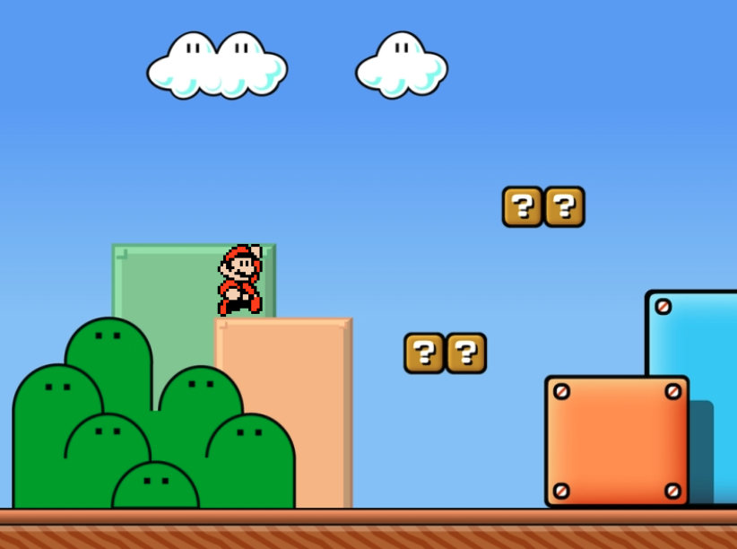

TinyPlumber
===========

**TinyPlumber** is a tiny platformer game using PixiJS.

## Screenshots

This project is under development. Any screenshot displayed here has been taken during tests.

## License

This project is distributed under the WTFPL v2.0

## Credits

- **background.png** : https://www.pinterest.fr/pin/313844667760268699/ (temporarily borrowed, will be deleted soon)
- **mario.png** : https://www.spriters-resource.com/nes/supermariobros3/sheet/4230/
